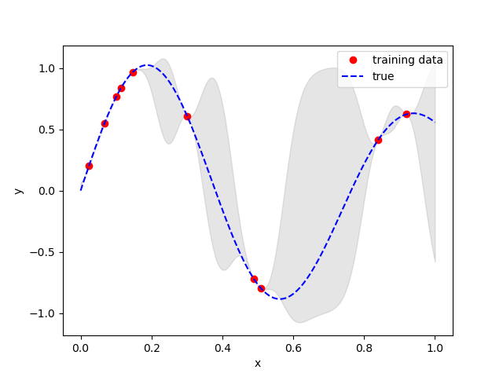

# Gaussian Processes

I wanted to try coding up a simple gaussian-processes predictor to help solidify it in my brain, so here it is. `gaussian_processes.py` is a simple little script that samples some random "ground-truth" data and fits it to produce a figure like this.



## Installation
Requires python3
```console
pip3 install -r requirements.txt
```

## Running
python ./gaussian_processes.py
